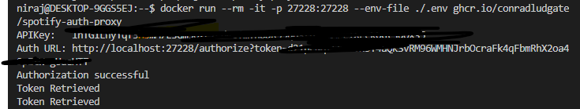
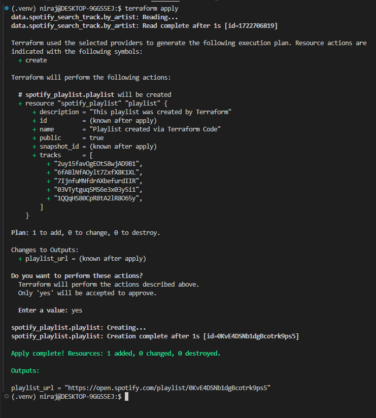

# Spotify playlist via Terraform

### Inspiration here:
https://developer.hashicorp.com/terraform/tutorials/community-providers/spotify-playlist


## Steps: 

### Set Environment Variables
Set the environment variables by getting values [here](https://developer.spotify.com/dashboard)

```
export SPOTIFY_CLIENT_REDIRECT_URI=http://localhost:27228/spotify_callback
export SPOTIFY_CLIENT_ID=
export SPOTIFY_CLIENT_SECRET=
```

## Run docker command
Ensure docker is installed
`docker run --rm -it -p 27228:27228 --env-file ./.env ghcr.io/conradludgate/spotify-auth-proxy`

You'll get API key after successful authorization.



## Run Terraform commands
 Terraform init `terraform init` to download the provider files.

 Terraform plan `terraform plan` to check the resources that Terraform is going to create.

 Terraform apply `terraform apply` to create the resources shown in the plan
  